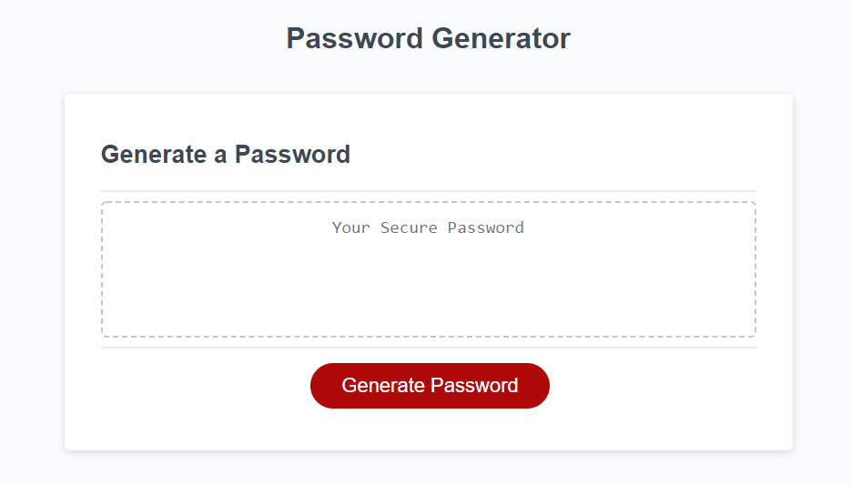

# RMOatman-Password-Generator

https://rmoatman.github.io/Oatman_Javascript_Password_Generator/

## Description
~~~
The intent of this project was to modify starter JavaScript code to create an application that enables employees to generate random passwords based on criteria that they’ve selected.  This app runs in the browser and features dynamically updated HTML and CSS powered by JavaScript code.

The user is prompted using an "prompt" box to choose the length of the password between 8 and 128 characters.  If anything else is selected other than a number from 8-128, the user is directed to select again.

Once the length is determined, the user is asked with a "confirm" box to choose what combination of lowercase letter, uppercase letter, number and special character sets they would like to include.  If no character set is selected, they are reminded by an alert that at least one set is necessary, and they are "prompted" to start again.

The core skills demonstrated in this project include creating an addEventListener to recognize when a button is clicked; using the prompt and confirm boxes; and modifiying an element in the window to display results.  I also used vaious methods like concat() and push() for the first time.
~~~

## Application and Reflection
~~~
I coded the JavaScript twice.  First, I used all prompt boxes.  This created a lot of repeated code in order to validate for "Y" or "y"or "N" or "n" responses to each of the four character set questions.  Next, I used a prompt box for the password length--and confirm boxes for the rest.  That required much less coding and presented an easier to follow path through the JavaScript.

I had difficulty in two particular areas.  My first challenge was how to confirm that at least one character type was chosen--and if not, how to alert the user and start over. Initially I called a function from within itself.  While that worked during the first iteration, subsequent iterations produced unexpected results (passwords double the desired length).  In order to ensure the correct password length, I broke the functions down into smaller functions.  That eliminated calling a function from within itself.

My second challenge continues to be how to validate that at least one character of every selected set is represented in the final password.  I can compare each character of the password array with a single appropriate character array--but I can't get the nesting or organzition quite right to compare the password array with all the character arrays in one pass.  I will continue to work on this as I think it will be useful in the future.
~~~

## Additional References
~~~
- List of password special characters: https://www.owasp.org/index.php/Password_special/characters
~~~

## Contact Information
~~~
- Raemarie Oatman
- raemarie.oatman@gmail.com
- https://www.linkedin.com/in/raemarieoatman
- https://github.com/rmoatman
~~~
